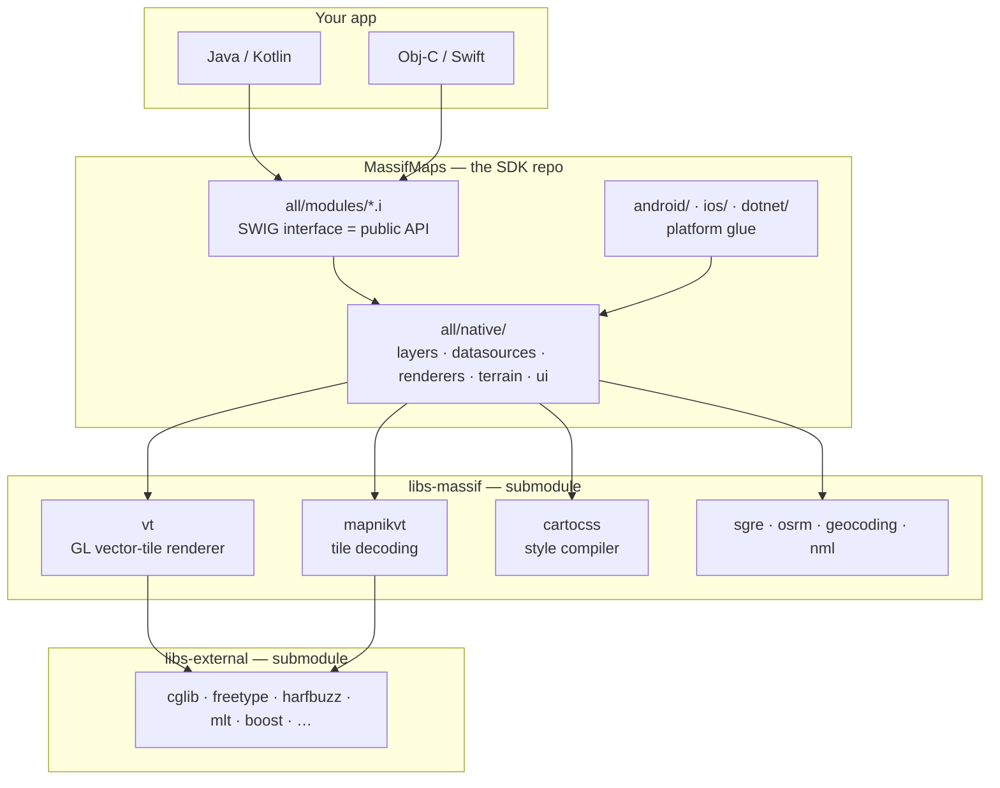
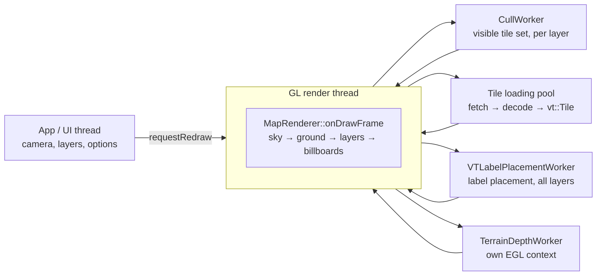
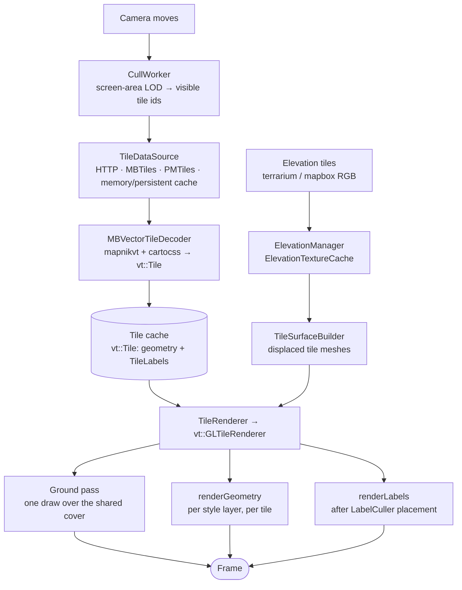

# Internals

How the SDK actually works, for the person — or the agent — who has to change it. User-facing
documentation is under [Guides](/docs/category/guides) and [Features](/docs/features/3d-terrain);
this section is the implementation.

Every page states its scope at the top and links out instead of repeating, so **one page can be
read without the rest**.

## Find the page you need

| You are working on | Read |
|---|---|
| the render path (frame, tiles, terrain, depth, labels, lighting…) | [Render pipeline](/docs/internals/rendering/) |
| binary size, build time, ccache/ninja, what a profile costs | [Binary size & build time](/docs/internals/build-and-size) |
| PMTiles archive internals | [PMTiles data source](/docs/internals/pmtiles-datasource) |
| camera and touch events — which thread, and when each fires | [Map events](/docs/internals/map-events) |
| the facade API — the C ABI, the generated property table, specs, events, calls | [Facade API](/docs/internals/api-facade) |
| giving the facade's strings autocompletion, per language | [API autocompletion](/docs/internals/api-autocompletion) |
| what was measured, when, and which ideas failed | [Performance lab notebook](/docs/internals/performance-log) |
| upgrading a vendored dependency, regenerating artefacts | [Maintenance](/docs/maintenance/) |
| renaming from the CARTO SDK | [Migration](/docs/migration) |

## Repository map

Three git repositories: the SDK and two submodules. A change under `libs-massif/` or
`libs-external/` is a commit **in that submodule**, then a pointer bump here.

| Path | What it is |
|---|---|
| `all/native/` | the C++ core — layers, renderers, data sources, projections, terrain, UI |
| `all/modules/*.i` | SWIG interface files; the **public API surface**, mirroring `all/native` |
| `android/`, `ios/`, `dotnet/`, `winphone/` | platform glue (hand-written `MapView` wrappers live here, not in SWIG) |
| `libs-massif/` | submodule: `vt` (GL renderer), `mapnikvt`, `cartocss`, `sgre`/`osrm`, `geocoding`, `nml` |
| `libs-external/` | submodule: third-party dependencies |
| `scripts/` | build scripts, SWIG generators, the Android and iOS dev benches |
| `routing-lib/` | the standalone Valhalla routing library, no renderer |

A public API change is **breaking for every binding** even when the C++ compiles, and the SWIG
wrappers are never regenerated by gradle — see [Building the docs and the
API](/docs/contributing-docs) and `BUILDING.md`.

## Threads

Nothing in the SDK is a free-running loop. The GL thread draws when something calls
`MapRenderer::requestRedraw()`; everything expensive is pushed off it.

Details, and the rule that has held for every performance round, in
[Frame & threads](/docs/internals/rendering/frame).

## From a tile request to a pixel

Each box has a page: [Tiles & LOD](/docs/internals/rendering/tiles),
[GL vector-tile renderer](/docs/internals/rendering/vt-renderer),
[3D terrain](/docs/internals/rendering/terrain),
[Labels](/docs/internals/rendering/labels).

## Two rules that shaped the render code

**1. [tangram-ng](https://github.com/farfromrefug/tangram-ng) is the reference implementation, and
we copy it.** It renders the same data on the same devices, sharply and with no see-through. Its
constants are copied, not derived — every constant this project derived instead turned out wrong.
Each mechanism is ported **whole**: half of its depth model measured worse than none of it, three
times over. When comparing, read its **scene files** (`res/scenes/*.yaml`), not only its shaders;
the shader defaults are overridden there. The catalogue of what differs and why is in
[vs tangram-ng](/docs/internals/rendering/tangram-diff).

**2. Measurements go in the notebook, not in a comment.** A number that came from a bench belongs
in [the performance log](/docs/internals/performance-log) with its camera and method; the code keeps
the constant and one clause of why.

## Known gaps

Stated so silence is not mistaken for "there is nothing there":

- **Startup / first frame** — ~3.8 s to first content with a warm cache, ~1.3 s of it before the
  first tile is requested. Measured, not yet attributed.
- **Spherical projection** (`RenderProjectionMode::SPHERICAL`) — none of the 3D terrain work applies
  to it.
- **Platform specifics** — iOS/UWP GL context setup and the `angle-metal` backend.
- **The RTT drape** — the old per-tile render-target path, deliberately undocumented because it is
  being removed. Do not build on it.
