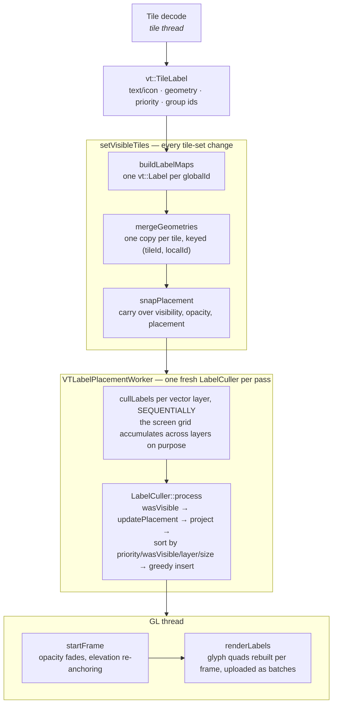

# Labels

Scope: text and icon labels from decoded tiles to screen. Contour labels specifically are in
[07-hillshade-contours.md](07-hillshade-contours.md#contour-labels-without-contour-geometry).

## The pipeline



Two invariants live in this picture and both have caused visible bugs: `LabelCuller::process` must
**not** clear the grid (layers must collide with each other), and `snapPlacement` must prefer the
same `(tileId, localId)` copy. Details below.

## Building the label set

On **every tile-set change**, `buildLabelMaps` recreates all `vt::Label` objects from the current
tiles. Labels with the same `globalId` from different tiles are merged (`mergeGeometries` — one
geometry copy per tile, identified by `(tileId, localId)`), and visibility, opacity and placement
are carried over from the previous object via `snapPlacement`.

**Placement stability invariant.** `snapPlacement` / `findSnappedPointPlacement` /
`findSnappedLinePlacement` prefer the geometry copy with the same `(tileId, localId)` as the previous
placement. Without that, re-snapping picks a winner by merged-list order — which changes with the
tile set — and a placement rebuilt from a differently clipped copy of a line can fail line fitting
(`buildLineVertexData`), after which the culler hides an already visible label. That is what
"labels jump and disappear while panning" looked like. Keep the invariant when touching `Label` or
`LabelCuller`.

**Draw order is one list per pass**, sorted by priority → layer index → global id, and the batch
changes glyph atlas mid-list. Grouping the labels by atlas first — which is what a
`unordered_map<Bitmap, ...>` did — put two labels from different atlases in **pointer-hash order**,
so an icon and the small label meant to sit on it were drawn in whichever order the allocator
happened to give. It only showed below the raster-ladder boundary, where the smaller label lands in
another atlas than the icon: `text-size: 11` drew over the icon and `text-size: 10` under it.

Known remaining cost: `buildLabelMaps` reallocates every label on every tile-set change during
panning. Reusing unchanged labels is the next win here, and it is delicate — it relies on fresh
caches and `snapPlacement` semantics.

## Placement and culling

`VTLabelPlacementWorker` runs on `MapRenderer::vtLabelsChanged` (i.e. whenever draw data changes),
creates **one fresh `LabelCuller` per pass**, and calls `TileRenderer::cullLabels` for every vector
layer **sequentially**. The culler's screen grid accumulates across layers on purpose, so labels of
different layers collide with each other. `LabelCuller::process` therefore must **not** clear the
grid.

`LabelCuller::process`:

1. captures `wasVisible`;
2. `Label::updatePlacement` — only re-places a label when its envelope has fully left the frustum;
   resets opacity;
3. projects envelopes to screen space;
4. sorts by priority → `wasVisible` → layer index → size → opacity;
5. greedily inserts into a **16×32 screen grid** with SAT polygon-overlap tests.

A visible label keeps its slot unless a strictly higher-priority label overlaps it — that hysteresis
is what stops labels flickering when the camera moves slightly.

Fork-specific rules, all comparing the **placement's** `localId` (hence the stability invariant
above): `allowOverlapSameFeatureId`, `sameFeatureIdDependent`, and group ids with
`minimumGroupDistance`.

### Line runs: `line` lies flat, `billboard-line` stays upright

Three placements walk the line at `text-spacing`. Two of them lay a glyph **run** out along it
(`Label::isLineRun`) and differ only in the plane `buildLineVertexData` picks; the third lays out no
run at all:

| `text-placement` | `LabelOrientation` | run laid out on | drawn as |
|---|---|---|---|
| `line` | `LINE` | the placement's own tangent frame (`placement->xAxis/yAxis`), no projection | flat on the surface, `WORLD_OFFSET` |
| `billboard-line` | `LINE_BILLBOARD_3D` | the camera axes, through the view-projection | upright, `CAMERA_AXIS_OFFSET` |
| `billboard-line-repeat` | *(never reaches vt — becomes `BILLBOARD_3D`)* | not laid out on the line: one label per step, in its own box | upright, `CAMERA_AXIS_OFFSET` |

`line` is the map-like one: the text lies in the ground plane like the line it names, so it tilts and
foreshortens with the map. `billboard-line` keeps its size and its shape at any tilt, at the cost of
no longer lying on the surface — which is what a road name usually wants and a route distance usually
does not. `billboard-line-repeat` is the road-shield case: the repeat along the line is wanted, the
run following it is not.

`billboard-line-repeat` is resolved in the **symbolizers**, not in vt: they repeat it like the other
line placements, hand the label a `BILLBOARD_3D` style and, unlike a run, **no line** — `Label` snaps
a placement to `_tileLines` in preference to `_tilePoints`, and `TileLayerBuilder` tesselates a line
a billboard would never read. On a feature that is not a line it is the plain billboard its name
says (`repeat` is decided per feature). It is also what `nutibillboardline` now maps to, which is
what that spelling meant in 5.x.

**This was a regression between 5.x and 6.0.** `LINE` was moved to the camera-axis layout wholesale
("lay line labels out in screen space"), so `text-placement: line` silently became a billboard and
there was no way back to the flat run; the only thing still drawing text flat was `text-clip`, which
is not a label at all (see below). The two layouts are now separate orientations, `line` is flat
again, and `billboard-line` — which used to place one upright point label per `text-spacing` step,
ignoring the line direction — takes the run that follows the line. That 5.x behaviour is
`billboard-line-repeat`, added once the split turned out to have removed the only way to repeat a
shield along a road without turning it with the road.

Consequences of the split, all keyed on `isLineRun()` / `isScreenLineRun()`:

- The layout cache is keyed on the **view-projection only for a screen run**. A flat run does not
  depend on the camera, so keying it on the view rebuilt it every frame for nothing.
- The envelope is the run's bounds put back on **the label's own axes** (`setupCoordinateSystem`),
  which is the camera basis for one and the tangent frame for the other.
- Anchor pixel-snapping is skipped for both: it snaps the anchor to a quarter-pixel grid, which is
  meaningless once the glyphs are laid out along a line rather than in a box.
- `TextSymbolizer` feeds all three the same anchors, `text-spacing` and measured run length
  (`repeatAlongLine`), and hands the line itself only to the two that lay a run out (`lineRun`). The
  bare vertex with an empty vertex list — why `billboard-line` could not follow anything before the
  split — is now exactly what `billboard-line-repeat` asks for.

**A layout fails in two different ways, and they are held differently** (`Label::LineLayout`):

- `NO_ROOM` — the run does not fit, or nothing projects. That is a transient of this camera: fit is
  judged on the projected line, from two different view states (the culler works on its pass's
  snapshot, the renderer on the current camera), so a run at the edge of what fits alternates
  between them and blinks at frame rate. A run already on screen rides out `LINE_LAYOUT_FAILURE_GRACE`
  of these.
- `UNREADABLE` — the glyphs turn far enough to pile up on the inside of a corner
  (`MIN_LINE_SEGMENT_DOTPRODUCT`, `MAX_LINE_RUN_ANGLE_SPREAD`), or the run doubles back. That is a
  property of the line's shape at this scale, not of the camera. It gets **no grace**, and its quads
  are dropped rather than kept: the grace used to cover both, so a run the layout had just measured
  as illegible stayed on screen for several passes — the reported "characters over each other at a
  bend".

**`text-spacing: 0` means one run for the WHOLE line on both paths.** The clip path used to restart
the pen at the middle of every segment, so the same style drew one label per line when it was culled
and one per bend when it was clipped (`generateLinePoints`). A segment outside the tile now still
advances the pen, so the spacing is constant along the line instead of restarting at each tile
border. Clipped text still gets one run per TILE the line crosses — the geometry is per tile and
there is no label to merge them.

`text-spacing` places anchors by **ground** distance, as mapbox's `symbol-spacing` does; under tilt
they project closer together in the far field. The screen-space guarantee is `text-min-distance`,
which gives the label a group id the culler enforces in pixels.

**A candidate stretch of line is measured in the plane its run will be laid out in**, and the same
measure both ranks the candidates and decides whether the run fits (`findClippedLinePlacement`). A
screen run has to be compared on screen — a line running away from a tilted camera is worth a
fraction of its ground length there, and measured on the ground it wins the placement and then does
not fit. A flat run is compared on the ground, because that is where it lies: it used to be judged
against a screen-HORIZONTAL run of the same world length, which asks for several times the room it
needs as soon as the view tilts. That is what "the label only appears if I zoom in a lot, and once
it is gone I have to zoom much further to get it back" was — the asymmetry is the layout hysteresis
(`LINE_LAYOUT_FAILURE_GRACE`, `*_KEEP` thresholds) holding a placed run that a fresh search could no
longer win.

### Text drawn as geometry (`text-clip`)

`text-clip` takes the text off the label pipeline entirely: `TextSymbolizer` builds `vt::TextStyle`
glyph quads into the tile geometry (`createTextProcessor`), clipped to the tile. What that costs is
everything the label pipeline is:

| | label path | `text-clip: true` |
|---|---|---|
| culling, `text-allow-overlap`, `text-min-distance` | yes | **none** — there is no `vt::Label` to cull |
| placement along the line | per glyph, follows the run (`buildLineVertexData`) | whole run rotated by its segment's angle |
| `text-spacing: 0` (the default) | ONE label for the whole line | one at the **midpoint of every segment** |
| orientation | `line` / `billboard-line` / `billboard-line-repeat` / `billboard` / `point` | always flat — geometry has no camera basis |
| tile border | the label is placed across it | glyphs are **cut**, that is what clip means |

**It used to default to `text-allow-overlap`** (upstream, 2019, no rationale recorded), so a style
that only wanted its labels to overlap silently got the geometry path — and with it every row of that
table. It now defaults to `false`, its own declared default, and the same applies to
`shield-clip`. `marker-clip` is left coupled: an icon has no run to lay out and no name to place, and
`marker-allow-overlap: true` on a dense POI layer is exactly the case the geometry path is cheap for.

Under clip, `billboard-line` is treated as `line` — the run is rotated by its segment's angle rather
than left horizontal. Clipped text cannot be a billboard at all, and leaving it unrotated was the one
combination that neither followed the line nor stayed upright. `billboard-line-repeat` is the
exception: it has no run to follow the line with, so its repeats keep the style's own angle
(`generateLinePoints(..., applyAngle = lineRun)`), which is the closest the geometry path gets to a
billboard.

Over 3D terrain its glyph quads take the line shader's rule: the terrain is sampled at the
**extruded corner** (`applyTerrain(pos + delta)` in `pointVsh`), not at the anchor. A quad placed at
the anchor's height and then offset sideways is a flat plate, and on a slope its uphill half sits
under the ground, where the depth test against the terrain surface eats it — letters cut in half.
The line shader learned the same lesson earlier, on a route casing breaking up on a cross-slope.

That path shares the SDF encoding with labels and has to be kept in step with it: its antialias ramp
is `2 · GLYPH_SDF_UNIT · (glyphRenderSize − GLYPH_RENDER_SPREAD) / _fullResolution`, the same rule
`renderLabelBatch` uses, and its halo is converted with `HALO_PIXELS_PER_UNIT` like a label's. The
form written for the single 27-texel raster and a spread of 4 survived the raster ladder and the
spread change (4 → 8) and ended up measuring a ramp up to **six screen pixels**, which is a glyph
dissolving into its own halo.

### Label size and the camera (fork-specific)

In a planar projection a label keeps a **constant on-screen size**: its world size comes from the
zoom alone, so the perspective divide would otherwise blow it up towards the camera on a tilted view
(and 3D terrain, which lifts anchors by a kilometre, made that obvious). `calculateTerrainScaleFactor`
cancels it by scaling the label with `viewDepth / focusDepth`.

`focusDepth` is the distance the zoom is calibrated at — the **camera-to-focus distance**, which
`TileRenderer` puts in `ViewState::focusDistance` for both the render and the cull pass. vt used to
guess it as the point where the view axis meets the z=0 plane; that is the same number only while
the focus sits ON the ground. Lift the viewpoint (free roam, a panorama from 2600 m) or aim at the
horizon and the guess runs away, shrinking every label on screen as the camera rises or flattens —
which is what "labels get smaller as I go up or pan" was. `focusDistance` 0 falls back to the old
guess, so a host that does not set it behaves as before.

A **callout** is sized differently: it is a screen object, so one glyph unit is `size` pixels taken
off the projection (`calculateLabelScale` → `calculatePixelToWorld`), not off the zoom. The
zoom-derived scale keeps a constant screen size only while the camera distance follows the zoom,
and free roam breaks that — lift the viewpoint or tilt and the names grow or shrink on screen.

### Callout labels (fork-specific)

`LabelOrientation::CALLOUT` — style `text-placement: callout` — is a point label **lifted away
from its anchor in screen space** and joined back to it by a leader line. It exists because a
panorama is the case the ordinary rules answer badly: hundreds of summits within a few degrees of
the horizon, all wanting the same band of pixels, and hiding all but a handful of them loses exactly
the information the view is for.

What changes, and only for this orientation:

- **`LabelCuller::placeCalloutLabel` replaces the hide.** The label is placed at its band
  (`text-callout-screen-anchor`, a fraction of the screen height from the top; below 0 it stacks
  from its own anchor instead), and while the grid says it is taken it moves up one
  `text-callout-step` at a time, for at most `text-callout-max-rows` rows. Everything else — the
  priority sort, the `wasVisible` hysteresis, the shared grid — is untouched, so callouts collide
  with ordinary labels and with each other in the usual way.
- **The lift is in SCREEN PIXELS, and it stays there.** Two things make that true, and both had to
  be fixed before a row of names was a row:
  - *The conversion is read off the projection, not off the label's scale.* One pixel is
    `depth / (projection scale × half the screen height)` world units at the label's own depth
    (`Label::calculatePixelToWorld`). Converting with the label's scale instead — which comes from
    the zoom — makes the same stored lift mean a different number of pixels whenever the camera
    tilts, rises or zooms, so the labels slide up and down the screen between placement passes.
  - *The anchor moves; the label does not follow it.* Labels are re-anchored on the GL thread as
    elevation tiles arrive (`updateElevation`), and a tilt slides the anchor up or down the screen,
    while a placement pass only runs when the draw data changes. The culler therefore records the
    anchor's screen position along with the lift (`setCalloutPlacement`) and the draw path corrects
    by how far it has moved since (`calculateCalloutLift`), so the label holds its LINE rather than
    its distance from a summit that has meanwhile moved.
- **The leader line is one more quad in the label's own vertex stream**, textured from a 4×4 white
  cell loaded into the glyph atlas (`TileLabel::Style::calloutLineGlyph`). It is built per frame
  rather than cached with the text — its length is the offset, which changes with everything else
  on screen — and only once, after both text passes, since a halo copy would just draw it twice.
  Sampling the cell's interior matters: the outer texels blend into the atlas padding under linear
  filtering, which thins the line and fades its ends.
- **A callout has to fit on the screen ABOVE its feature, or it is dropped.** Every other label is
  evidence of its own visibility; this one is drawn where it is not anchored, so the culler measures
  the lift against a constant `SCREEN_EDGE_MARGIN` short of the top edge. The margin is a constant
  on purpose: it also caps a label the band placed correctly, and a margin proportional to the
  label's own height then pushes long names further down than short ones — the row stops being a
  row. A summit already so high in the frame that its name does not fit above it **loses the name**;
  the rows never descend below `text-callout-offset` either.
  Pulling the lift back down to the cap instead (what this did before) put the label BELOW its own
  summit: off the band the style asks for, and at a negative lift with no leader line at all — which
  is what a panorama looked like whenever the ridges sat high in the frame.
- Rotation (`text-orientation`) stays with the CALLOUT placement instead of downgrading to POINT —
  angled names over a horizon is the whole look.
- **The grazing-view gate does not apply** (`Label::isSurfaceFacingView`). Every other orientation
  is laid out against the surface it is anchored on and is dropped once the view meets that surface
  edge-on (`MIN_BILLBOARD_VIEW_NORMAL_DOTPRODUCT`, 0.1 — no labels at all below ~6° of tilt). A
  callout faces the camera and is lifted along the camera up axis, so the angle says nothing about
  whether it can be read, and a panorama — tilt near 0, or negative when the camera looks above the
  horizon — is that view by definition. Before this, a peak-finder view lost every name as soon as
  it was levelled at the ridges.

**Which point of the label is anchored.** Two style properties, both naming a point of the label's
own box — `center`, `left`, `right`, `top`, `bottom`, `top-left`, `top-right`, `bottom-left`,
`bottom-right` — rotated with the text, so on a name tilted 55° the `bottom-left` corner is where
its first letter starts:

```css
#mountain_peak {
  text-callout-line-anchor: bottom-left;  /* held over the summit; where the leader line ends */
  text-callout-align: top-right;          /* the point put on the band line */
}
```

`text-callout-line-anchor` **moves the label** so that point lands on the anchor's vertical
(`Label::calculateCalloutShift`, applied to the glyph offsets, the plate and the envelope alike) —
which is what keeps every leader line vertical while the text starts exactly above its summit.
`text-callout-align` only decides what the band line is measured against (`LabelCuller` reads that
point off the screen envelope by bilinear interpolation of its four corners). The pair is what the
two panorama looks are made of: names pinned to the top of the screen hang from their `top-right`
corner so the text stays under the edge, names in a band lower down line up on the same
`bottom-left` corner they are anchored by. Unset (the default) keeps the old behaviour: the text
laid out around its own anchor, the band measured against the bottom of the bounding box.

### A second run of text (fork-specific)

A summit name and its elevation are one label with two type sizes. `TextFormatter::Options` carries
an optional second run, so it is laid out **with** the first one — one baseline, one bounding box,
one background plate, one colour:

```css
#mountain_peak {
  text-name: [name];
  text-secondary-name: [ele]+'m';
  text-secondary-scale: 0.62;   /* of the main font size */
  text-secondary-dx: 3;         /* gap before it, pixels */
  text-secondary-dy: 0;         /* baseline shift, pixels, down positive */
}
```

`TextFormatter::appendSecondaryRun` lays the run out on its own (left aligned), scales its glyph
geometry, and rebases its `CR` pseudo-glyphs — which carry an **absolute** pen position, see
`Label::buildPointVertexData` — onto the end of the first run. Both runs then shift by the share of
the extra width the alignment asks for, so `text-horizontal-alignment` still applies to the pair.
The glyphs come from the same atlas raster as the main text, so a very small scale is a magnified
raster: this is for a suffix, not for a second paragraph.

### Ranking with the view (fork-specific)

`text-placement-priority` is evaluated once, at decode time, from the feature. A panorama also wants
to rank by something only the frame knows — how far the summit is — so a label style may carry a
**rank function**, evaluated by the culler once per label per placement pass and **added to the
priority**:

```css
#mountain_peak {
  text-placement-priority: [ele];              /* the higher summit claims the row ... */
  text-rank: 0 - [view::distance]/100;         /* ... and the nearer of two equals wins it */
}
```

`view::distance` is metres from the camera to the label being ranked. It is defined **only** in this
evaluation: `ViewState::labelDistance` is 0 everywhere else, because the renderer evaluates a style
function once per batch (`GLTileRenderer::renderLabelPass` packs colour and size into a 16-slot
parameter table) and a per-label value there would cost a batch per label. Ranking never changes how
a label looks — only which of two colliding labels keeps its slot.

Two notes for style authors:

- Prefer an expression that reads **only** the view state. It has no feature dependency, so
  `FloatFunctionProperty::getFunction` hands every feature the same function object and the label
  style is not rebuilt per feature. An expression that reads no view state at all is as good: it
  folds to a constant at decode, and two features answering alike share one function object — that
  holds for a style parameter read together with a field
  (`text-rank: get([param::poi_rank], [class], 100)`), which the property resolves at decode rather
  than keeping behind the store, since such a parameter can never be live anyway
  (`GenericFunctionProperty::foldsStyleParams`). Mixing the two — a field *and* `view::distance` —
  is what costs a closure and a label style per feature.
- `0 - x`, not `-x`: CartoCSS's `literal` rule accepts `-` as a first character, so a leading minus
  in front of a field is read as the literal string `"-"` and the declaration fails to parse.

- **A callout keeps the row it holds.** The offset is carried across label rebuilds
  (`snapPlacement` — it belongs to the label, not to the tiles it was built from; without that, a
  rebuilt label drops onto its own anchor until the next placement pass, which is a whole screen
  of names jumping every time tiles stream in), and a label that was visible tries its previous
  row before any other. `text-callout-persist: <passes>` goes further: a name already on screen may
  fail placement that many consecutive passes before it is hidden, so it does not blink out and
  back in while the camera moves. Default 0 — hide on the first failure, as before. A held-over
  name may sit closer to its neighbours than `text-min-distance` allows, but never **on top** of
  one: a placement pass only runs when the draw data changes, so an overlap granted here would
  stay on screen until something else moved. It is held on the band's own line too, never at the
  lift it happened to have — a name kept off the row is what the row exists to avoid.
- **The step's sign is the stacking direction.** A negative `text-callout-step` stacks the rows
  DOWNWARDS, which is what a band pinned to the top of the screen needs: there is no room above it,
  so stepping up piles every row that loses its slot into the top edge — and since the ranking puts
  the nearest summits first, the effect reads as "the closer the label, the lower it sits".
- **The group's minimum distance is tested at every row.** `text-min-distance` is what thins a
  crowded ridge out, and testing it only after placement would put a label on a free row and then
  hide it for being too close to a neighbour — the one outcome the stacking exists to avoid.

Picking is unchanged and needs nothing new: `GLTileRenderer::findLabelIntersections` tests the
placed geometry, so a callout is clicked where it is drawn, at the end of its leader line.

### Anchored shields: the name takes a free side (fork-specific)

A shield is ONE label whose glyph run is `[icon glyphs] CR [text glyphs …]`: the icon comes before
the first line break and the text after it, and `buildPointVertexData` resets the pen at that break.
Everything below rests on that split — the icon stays on the feature, only the text moves.

```css
#poi {
  shield-name: [name];
  shield-file: url(shields/place.svg);   /* a bitmap icon, as before */
  shield-icon-name: '<PUA char>';        /* AND/OR a font icon: one glyph of an icon face */
  shield-icon-face-name: 'osm';
  shield-icon-size: 15; shield-icon-fill: #b5651d;
  shield-anchors: 'right,left,top,bottom';  /* sides, in preference order */
  shield-text-optional: true;               /* no side free -> draw the icon alone */
  shield-text-dx: 2;                        /* gap from the icon, MIRRORED per side */
}
```

- **The sides are precomputed, the choice is per pass.** `TileLayerBuilder` measures the text once
  and stores one `TileLabel::Variant` per anchor — a `vec2` shift of the text pen and a `drawText`
  flag. No extra glyph run, no extra formatting: the block is placed against the icon's edge, so the
  style's own `horizontal-alignment` does not have to be mirrored, and `dx`/`dy` are re-applied as a
  gap along the anchor direction (a name pushed 2 px right of the icon is pushed 2 px LEFT on the
  left side). A style with no `shield-anchors` builds no variants and takes exactly the old path.
- **`LabelCuller::placeAnchoredLabel`** tries the side the label already holds first and then the
  style's order, taking the first free one — tangram's
  `do { … } while (isOccluded() && nextAnchor())` (`labelManager.cpp`), with their anchor set and
  order. Keeping the current side is what stops a name swapping sides under a moving camera; the
  exception is the icon-only variant, which is smaller than every other one and therefore always
  fits, so a label that fell back to it once would keep it for good and its name would never come
  back. It is never the preferred side.
- Along the side's own axis the text is placed against the icon's **edge**, and `dx`/`dy` become a
  gap pushed away from the icon. Across that axis it is **centred on the anchor** — a name above the
  icon has to sit over it, and the formatter's own alignment is derived from the sign of `dx`, which
  means nothing once `dx` is a gap.
- `shield-text-optional` appends a last variant that draws the icon alone. That is mapbox's
  `text-optional`; here it costs one more variant, not a second label.
- The side is carried across rebuilds by `snapPlacement`, so a label recreated by a tile-set change
  does not start at side 0 for one frame before the next pass moves it back.
- **Placement is re-run when the camera zooms** (`MapRenderer::viewChanged`, ¼ of a zoom level). A
  pass is otherwise only asked for when the TILE SET changes, and a label's envelope is screen-space:
  zooming in makes room nothing notices. The pass is **postponed** rather than queued
  (`VTLabelPlacementWorker::postpone`), so a zoom gesture places once when it settles instead of
  re-deciding at every step — placing mid-gesture is what made labels fade in and straight back out.

**Which labels keep their text.** The culler sorts by priority → `wasVisible` → layer index → size →
opacity and inserts greedily, so a label sorted earlier claims its side first;
`shield-placement-priority` is the knob for "these names matter more than those", and a bigger
`shield-size` sorts earlier among equal priorities.

Insertion is **greedy and single-pass**: a label takes the first of its sides that is free, and a name
placed there may leave a neighbour's icon nowhere to go — the neighbour is hidden. That is what
mapbox does, and it is what makes a dense POI field readable: names win space from icons.

**Two alternatives were tried and reverted, both on the device and both worth not re-deriving:**

- *Yielding up front* — before taking a side, a label that can still shrink tests it against the
  smallest layout of every equal-priority label after it, and drops to its icon rather than cost that
  label its place. Correct on two labels; on two thousand every name overlaps *some* neighbour's
  icon, so every name yields and the map shows icons only. It also cost ~25% more culler time and
  raised visibility flips per pass from 4.4 to 6.9.
- *Two passes* — commit every label at its smallest layout, then grow each back where the screen is
  still free. No collapse, and the same cost as greedy (14.5 vs 15.4 ms per pass), but pass 1 keeps
  every icon that fits, so the dense camera showed ~18 names where greedy shows ~60. Icons are not
  worth that much.

So a name still displaces a lower-ranked icon, and `shield-placement-priority` is the only lever over
who wins.

### Justifying a wrapped name (fork-specific)

`shield-text-horizontal-alignment: 'left' | 'middle' | 'right' | 'auto'` justifies the LINES of a
wrapped name inside its block. `auto` follows the side the culler chose — flush left when the name
is to the right of its icon, flush right when it is to the left — and an explicit value is mirrored
the same way. Unset keeps every line centred, which is what the formatter always did.

It costs no second glyph run: the formatter still centres each line, and `Label` measures each
line's ink extent once (`measureTextLines`) and shifts the pen per line at draw time
(`calculateLineShift`). Single-line labels — nearly all of them — shift by zero.

This is also what fixes "the gap looks bigger on one side": for a single-line name the gap is
symmetric by construction (the text is placed against the icon's edge, and it measures the same
17 px either way on screen), but a centred short line inside a wider block sits away from the icon,
and only justification can close that.

**Cost of the sides.** All sides share the placement, the scale and the label's screen axes, so
`Label::calculateVariantEnvelopes` builds all of their envelopes in one call and the culler only
repeats the cheap part (project + grid test) per side. Measured on the emulator with a deliberately
extreme style (every POI anchored, ~2300 live labels, 4 sides + icon-only): **20.8 ms per culler
pass against 16.3 ms with the property unset**, and the frame time moves by under 1 ms — which is
the extra labels `text-optional` lets through, not the placement. Building one envelope per side
instead cost 27.8 ms per pass, so the shared setup is worth keeping. A style that does not use
`shield-anchors` measures identical to before. The pass runs on the placement worker; no frame
section shows it, which is why `RenderStats::cullerNs` (`cullMs=` in the `RenderStats:` line) exists.

### Font icons

`shield-icon-name` is a run of glyphs from an icon face, drawn before the text with its own colour
(`shield-icon-fill`, a third style slot next to the halo and the second text run) and its own size.
It is not a bitmap: the glyphs are SDF like the text, so they stay sharp at any zoom and cost one
atlas cell each.

The face has to be reached **through the label font** — `getFont(labelFont->getName(), iconFace)` —
because `FontManagerFont::shapeGlyphs` rasterizes a fallback's glyphs into the atlas of the font it
was called on, and one label can only be drawn from one atlas. Resolving the icon face on its own
and shaping with it gives glyphs in a different atlas and the label renders nothing. The face is
also re-requested at the render size the ICON is drawn at, not the text's, so a large icon next to
small text is not a magnified small raster.

A shield may carry both: the bitmap (`shield-file`) is the first prefix glyph and the icon run
follows it, so they sit side by side rather than on top of each other.

### Plates behind the text and behind the icon (fork-specific)

A label may carry two plates — one behind the text, one behind the icon run — each a rounded
rectangle with its own colour, corner radius, padding and border:

```css
#road_label {
  text-background-fill: #ffffff;  text-background-opacity: 0.85;   /* also on a shield: */
  text-background-radius: 3;                                        /*   shield-background-*   */
  text-background-padding-x: 4; text-background-padding-y: 2;       /*   shield-icon-background-* */
  text-background-border-fill: #444444; text-background-border-width: 1;
}
```

- A plate is **3-sliced from one atlas cell** (`buildRoundedRectBitmap`, cached by radius, the glyph
  map dedupes by pointer): left cap, stretched middle, right cap — which is what keeps the corners
  round at any name width.
- The **border is a second plate behind the fill**, one border width larger on every side and with
  its corner radius grown to match. That is why it needs no shader and no second texture: it is the
  same cell drawn bigger in another colour.
- Both plates are part of what the label covers, so `calculatePlatedBBox` grows the envelope by
  their padding and border — the culler tests what is actually drawn, and a callout's leader line
  ends outside the plate rather than inside it. The box is in **glyph units**, so the padding is
  converted with `1 / size` and not with the world-units-per-pixel `scale / size` the drawn plate
  uses (`appendPlate` adds it after multiplying the box by `scale`). Getting that wrong grows the
  padding by a further factor of `scale` — tens to hundreds for a callout, which keeps its pixel
  size by taking `scale` off the projection: labels then reserve far more screen than they cover
  (a panorama loses half its names to collisions) and the leader line stops short of the plate by
  that same amount.
- Each colour is one slot in the label batch, like the halo (`LabelBatchParameters::MAX_PARAMETERS`
  is 16; a style using both plates with borders takes 4 of them plus text, halo, secondary and icon).

**Cost**, measured on the emulator with a plate behind the name AND behind the icon on ~2100 labels:
vertex build **4.6 → 5.2 µs per label per frame** (+13%) and batch time **12.8 → 17.8 µs per label**
(+39%), i.e. about **+1 ms per frame at 2100 plated labels**, and no change in draw-call count
(≈60/s either way). It is proportional to the plated labels on screen: each plate is 3 quads built
in the same loop as the glyph quads, so a screen of road shields — tens, not thousands — is far
below what the frame-time noise on this emulator can even resolve.


### Max distance (fork-specific)

A label glyph is screen-space: a street name 5 km away is drawn at the same size as one 50 m away,
so a tilted view fills its horizon band with labels nobody can read. Which labels a tile carries is
already decided by the style at the **tile's** zoom (`TileReader` sets `adjustedZoom = tileId.zoom +
bias`), and coarser far tiles — see [02-tiles.md](02-tiles.md) — thin them out a lot. The second
half of it is how far the labels that do exist may be seen:

```css
#transportation_name { text-max-distance: 2000; }   /* meters; 0 (default) = no limit */
#poi                 { marker-max-distance: 800; }
#shield              { shield-max-distance: 1500; }
```

It lives on the label **style** (`TileLabel::Style::maxDistance`), so it costs one comparison per
label per placement pass: `LabelCuller::process` measures the label's world anchor against
`ViewState::origin` and calls `setVisible(false)` beyond the limit. Hiding rather than skipping is
deliberate — the GL thread already animates opacity toward `isVisible()`, so the label **fades**
out when it passes the limit and fades back in when it returns, with no per-frame work.

Metres are converted with the mercator stretch at the view's own latitude
(`VTLabelPlacementWorker`), because 1/cos(45°) is a factor of 1.4 — too much to ignore in a number
a style author writes in metres. Tangram has no equivalent: their only control is the same per-tile
zoom filter.

## Font names (fork-specific)

A face name is a **CSS-like list**, most preferred first, and an entry may say which platform it is
for. `vt::parseFontNames` ([FontNames.cpp](https://github.com/massif-maps/massif-maps-libs/blob/develop/vt/src/vt/FontNames.cpp)) is the one
parser; `TextSymbolizer::getFont` runs it over `text-face-name` and over every name of a font set,
so a mapnik font set and a single comma-separated name end up as the same chain:

```css
#poi {
  text-face-name: "Roboto, Helvetica Neue, sans-serif";        /* one string */
  text-face-name: "android:Roboto", "ios:Helvetica Neue", "Arial";  /* or a real CSS list */
}
```

Names are tried back to front, so the first one that resolves becomes the main font and the rest its
glyph fallbacks; a list where nothing resolves keeps the style's fallback font. `android:`, `ios:`,
`macos:` and `windows:` are the tags — an entry tagged for another platform is dropped at parse
time, an untagged entry is kept everywhere.

**The system loader has to be strict for this to mean anything.** `SystemFontUtils::LoadFont` takes
an `allowFallback` flag: `MBVectorTileDecoder` installs it as the `FontManager`'s data loader with
`false`, so a name the device has no font for *fails* and the chain moves on. With the permissive
behaviour the first entry always resolved — to the platform default — and entries 2..n were dead
code. The style's fallback font (`Arial`, resolved permissively, outside the loader) still catches a
chain where nothing matched, so an inline CartoCSS style with no font of its own is unchanged.

Resolution is cached both ways in `FontManager` (`_fontDataMap` for a hit, `_missingFontSet` for a
miss), so a list costs one lookup per name once per style load, not per tile. That is why there is
no separate per-platform *option* — the tag inside the list is enough and does not repeat work.

**Vector elements do not use this path.** `BalloonPopup`, `Text` and the popup buttons draw into a
`BitmapCanvas` with the platform text API (Android `Typeface`, iOS CoreText, UWP DirectWrite), not
FreeType — none of the alias mapping applied to them before, so `Typeface.create` silently returned
the default for every name and no font name a style set had any visible effect.
`BitmapCanvas::setFont` now runs the list through `SystemFontUtils::MatchFont`, which resolves it
once (cached) to what the platform accepts:

- Android: an alias table (`FONT_ALIASES`) maps the name to a **family** (`sans-serif`,
  `sans-serif-light`, `serif`, `monospace`) — preferred over a font file, because a family keeps the
  per-script fallback chain a single `.ttf` does not. Only a font Android has no family name for
  falls back to `Typeface.createFromFile`, cached, since it re-parses the file on every call.
- iOS/UWP: the name is checked against CoreText / the DirectWrite collection before use, because
  both substitute the default font instead of failing.

One visible consequence: the default popup face `HelveticaNeue-Light` now maps to `sans-serif-light`
on Android instead of rendering as plain Roboto Regular.

## On the GL thread

- **Fades.** `updateLabel` moves opacity toward `visible ? 1 : 0`; invisible-but-fading labels stay
  rendered until they reach 0. Over terrain it also fades a label out when its anchor is behind a
  ridge — a stale occlusion buffer queried with the wrong camera is what made labels blink while
  zooming, see [04-terrain.md](04-terrain.md#query-with-the-buffers-camera-not-the-frames).
- **Occlusion by 3D content.** The ridge test above is a CPU query per label against a read-back
  terrain depth buffer, and terrain is all it knows: a label behind a *building* was drawn in front
  of it. The extra test is mapbox's, ported by semantics: the occluders are drawn once more into a
  half-resolution buffer from the same camera, and `labelVsh` samples a small square around the
  label's **anchor** and fades the whole label by how much of that square is in front of it. It is
  never clipped — a wall crossing a word does nothing, and a word is never cut in half. See
  [Per-label occlusion](#per-label-occlusion-by-3d-content) below.
- **Terrain anchoring.** Label geometry is built flat at decode time, so a label must be re-anchored
  onto the terrain: once when it is new, and afterwards only when the elevation under one of its
  tiles changed. `invalidateLabelElevation(tileIds)` marks exactly those; the blanket version exists
  for whole-data-set changes. Anchoring costs one elevation sample per label vertex, and a whole
  screen of labels goes dirty at once while elevation streams in. It still has to run to completion:
  a label left dirty is drawn and culled at its old height, which reads as labels popping in at the
  wrong place and settling.
  **This is the most expensive thing on the render thread over 3D terrain** — measured at ~750 000
  elevation samples per frame on the north pan with a full style, 82% of the render thread. Two
  faults made it that: `TileRenderer` classified every arriving DEM tile as a *scale-only* change
  and took the blanket path (see [04-terrain.md](04-terrain.md#cpu-height-queries)), and each sample
  re-derived its tile and its latitude scale from scratch.
  A label that has already been anchored and is neither placed nor on screen then **defers** its
  re-anchor (`Label::isElevationDirty`): it keeps the heights it has, at worst one LOD step out,
  and reports itself dirty again the moment the culler gives it a placement. A label that has never
  been anchored never defers — its geometry is still flat, and placing it at sea level under a
  mountain is what makes labels pop. That deferral measured **+6% and no more**, because most dirty
  labels do hold a placement.
  The bigger cut was the **vertex count itself**. A label's line went through the same terrain
  tesselation as a drawn line — including the lattice split, which cuts a segment at every surface
  cell edge *and* diagonal so that a painted line stays inside one triangle. A label line is never
  painted: it is read, to place glyphs and to anchor them. It now takes
  `TileTransformer::tesselateLabelLineString`, which halves to the **surface cell** and skips the
  lattice split — the profile a glyph run follows cannot carry more detail than the surface it is
  laid on. **`prepare` 157 → 72 ms, 1.75 → 2.10 fps.** The bound was measured first with
  `debug.massif.linesourcedensity 1` (no line subdivision at all): `prepare` 154 → 68, so the label
  path gives up almost nothing by keeping the surface-cell step.
  Visible cost: a glyph run can shift a few pixels along its line, and it may sag by the surface's
  own chord error where a segment crosses a cell diagonal. Contour labels — the most sensitive class,
  laid along a line the whole way — still track their line at the ridge camera.
  What remains is genuine volume: a changed DEM tile at z12 intersects every label tile beneath it,
  so "targeted" still means most of the screen.
- **Halo width is measured in antialias ramps, not in glyph texels.** `labelFsh` shifts the
  coverage ramp outward by the halo, and the ramp is one screen pixel of signed distance, so a halo
  reaching the renderer in screen pixels (`HALO_PIXELS_PER_UNIT`) is as wide as the style asks
  whatever raster the label landed on. It used to be converted with the glyph's RENDER size
  instead — harmless while every glyph was rastered at 27 texels, wrong the moment the raster ladder
  (16/28/40, see [10-performance.md](10-performance.md)) made that size depend on the label. The
  factor is `renderSize / (renderSize - spread)`: **3.0** on the smallest raster against **1.2** on
  the largest, so one `text-halo-radius` drew a halo two and a half times wider on a small label
  than on a large one, and up to **five times** what the single-raster build drew — a soft white
  glow instead of an outline, reported as "halo huge at radius 2, fine at 1". If halos ever look
  wrong again, check that term before the style.
- **A style `transform` no longer ends the batch.** The translate was a factor of the batch's
  `labelMatrix`, and the batch broke both when a label carried one and when the previous label did —
  so every transformed label was a draw of its own, **30 of a city frame's 68 label draws**.
  Conjugated by the tile matrix the translate is a *pure world translation*, so it is added to that
  label's vertices after `calculateVertexData` instead, and the label batches with its neighbours.
  Measured on the 2D city pan: **68.4 → 38.7 label draws a frame**, `labels2D` 4.89 → 4.24 ms, CPU
  frame 45.0 → 43.2. It also fixes a latent bug: several same-style labels *did* share a batch, and
  the matrix was built from the **first** label's tile, so the rest were translated by the wrong
  tile's frame.
- **One glyph atlas shared by every font at a render size — measured and dropped.** `FontManager`
  keys `_glyphMapMap` by the full font name, so every (family, size) pair owns an atlas and the
  16/28/40 ladder makes ~32 of them on a city screen; a batch ends whenever the atlas changes, which
  is the other half of the label draws. Keying by render size instead took the draws to 32.9 and
  bought **no frame rate**, and it makes overflow a live risk: a 2048² atlas is ~1764 cells at
  render size 40 against ~200 glyphs per family, and `GlyphMap::loadBitmapGlyph` returns 0 when full
  — glyphs vanish silently. Not worth a silent-text-loss failure mode for an unmeasurable gain. If it
  is retried, widen the atlas first and measure the fill.
- **The glyph atlas can be replaced under the batch loop.** `GlyphMap::getBitmapPattern()` returns
  the pattern **by value**, and a tile thread loading a new glyph resets `_bitmapPattern` — so the
  render thread's temporary can be the last owner. `renderLabelPass` bound its `labelBitmap`
  reference through that temporary's `->`, which extends nothing: the pattern died at the end of the
  line and the batch then compared and copied a freed `shared_ptr`. Crashed about half of the
  startups at a label-dense city camera, as either a null `bitmap` in `renderLabelBatch` or a
  `Scudo ERROR: invalid chunk state`. Hold the pattern in a named `shared_ptr` for the iteration.
- **Vertex data.** The glyph layout is already cached per label (`_cachedVertices`, `_cachedValid`)
  and the shader already expands the billboard from `offsets` + `uLabelAxisX/Y`. What runs every
  frame is re-emitting the **batch**: the anchor is camera-relative
  (`placement->position − viewState.origin`), so every vertex changes as soon as the camera moves.

  Measured on the city pan with draping on (Crosscall, 5.724/45.188 z15 t45, 27 fps, 28 frames per
  interval): `pass3D labels3D` 82.9 ms/interval (2.96 ms/frame), `labels2D` 46.3 (1.65),
  `buildMs` 45.7 (1.63), `batchMs` 21.6 (0.77), 3693 labels rebuilt (132/frame). The build splits
  placement 4.4 / line 10.3 / transform 10.8 / attrib 13.9 ms per interval. That is ~4.6 ms of a
  31.6 ms CPU frame, against a 37 ms wall frame and the 33.3 ms two-vsync boundary — the right size
  to matter, which is why it was tried.

  **Caching the two per-glyph loops does NOT help** (tried 2026-08-13, reverted): keeping the scaled
  `offsets` and the per-frame `attribs` per label, keyed on scale / camera axes / style slots /
  opacity, measured 26.6–27.4 fps against 27.1, with `transformMs` and `attribMs` unchanged. Two
  reasons, and the first is visible in the code: `scale` carries
  `calculateTerrainScaleFactor` = `depth / focusDistance`, which changes past its 1% quantum for
  most labels on every panned frame, so the cache misses; and copying N cached entries into the
  batch writes the same bytes the loop did, so a source-side cache cannot win if the cost is the
  batch write.

  What is left is the batch itself — and it has a prerequisite that has to come first.

### A persistent label batch, and what blocks it

The batch can only be kept across frames if nothing in it changes. Two things do:

- **The anchor**, `placement->position − viewState.origin`, moves with the camera. Solvable: quantize
  the origin to a grid and put it in `labelBatchParams.labelMatrix` (which already carries a
  `translate`). Absolute world coordinates are not an option — `WORLD_SIZE` is 2²⁰, so float32
  jitters ~2 m at the world edge, which is why the camera-relative form exists.
- **The scale**, and this is the real blocker. `offsets` hold `cachedVertex * scale`, and `scale`
  carries `calculateTerrainScaleFactor` = `depth / focusDistance`, quantized to ~1.09% steps. At z15
  the view is ~1 km wide and a pan moves ~0.5 km/s, so a label 500 m out changes depth by ~18 m per
  frame ≈ 3.6% — past the quantum. **Most labels change scale on most panned frames.**

So a persistent buffer, or any cache of the scaled offsets, rebuilds constantly — which is what the
reverted experiment above measured. The prerequisite is to stop scaling on the CPU: the perspective
cancel is a division by view depth, and the vertex shader can do it from `gl_Position.w`, which is
tangram's screen-space label model. CPU offsets then hold glyph units × zoom scale, constant through
a pan, and the batch becomes reusable.

The order to do it in, then: (1) move the perspective cancel into `labelVsh`, keeping
`calculateTerrainScaleFactor` on the CPU **for the culler's envelopes only** (collision is decided in
screen space and must not change); (2) cache the offsets, which step 1 has made view-independent;
(3) quantize the batch anchor and keep the batch arrays and GL buffers across frames, invalidated by
the label set, placements, opacities, style slots and the anchor.

**Step 1 was done, then reverted with step 3** (see [Reverted](#reverted-labels-jump-in-the-sky) at
the end of this section). `Label::CAMERA_AXIS_DEPTH_OFFSET` (attribs[3] = 2) told `labelVsh` to scale the
offset by `clamp(anchorClip.w * uLabelDepthScale, 0.05, 8.0)` — clip `w` is the view depth the CPU
factor was a ratio of, and `uLabelDepthScale` is 1 / camera-to-focus distance. The CPU then emits
offsets divided by that factor, so what is in the buffer depends on the zoom and the style, not on
where the camera is. It applies to `BILLBOARD_3D` and `LINE_BILLBOARD_3D` under a planar projection;
callouts keep the CPU factor (their lift and shift are measured against the same scale), and `LINE`
labels are view-dependent by construction.

It changes no frame rate on its own — 27.0–27.5 fps against a 27.1 baseline, and the per-glyph loop
still runs — which is the expected result: it is the enabler, not the win. Device-checked: label
sizes hold through tilt and pan. One cosmetic consequence: label plates still take the CPU factor,
which is quantized to ~1.09% steps where the shader's is exact, so a plate can sit ~1% off its text.

**Step 2 then measured nothing, and that settles the mechanism.** With the offsets now
view-independent, caching them per label gave `transformMs` 10.3–11.4 ms/interval against a 9.6–10.8
baseline and 24.9–27.0 fps against 27.1 — reverted. Together with the first attempt (which missed
because the key moved), this rules out the source side entirely: the timed region is dominated by
**writing into the batch arrays**, and copying N cached entries writes exactly the bytes the loop
wrote. No cache of what goes into the batch can win.

**Step 3, the batch kept across frames, was done and is now reverted — and there was a second view
dependency the plan above missed.** `Label::setupCoordinateSystem` snaps the anchor to a quarter of the screen pixel
grid (that is what keeps glyphs at a stable subpixel phase), and it did so by projecting the anchor
with the view-projection and inverting it back. So the anchor moved on every camera translation
whatever the scale did — and it cost a **4x4 double inverse per label per frame**, on the culler
thread too. Both are fixed: `ViewState` now carries `viewProjMatrix`/`invViewProjMatrix`, and for
the shader-cancel modes `labelVsh` does the snap itself on `anchorClip.xy` against
`uLabelScreenSize`. The CPU anchor is then `placement->position − viewState.labelOrigin`, where
`labelOrigin` is latched and only re-based once the camera has moved `LABEL_ORIGIN_LATCH_DISTANCE`
(256 internal units, ~10 km); the residual rides in the label matrix, which already carried a
translate. The culler keeps `viewState.origin` — its envelopes are camera-relative by construction.

What survives a frame, then, is the whole 3D pass: `GLTileRenderer::LabelBatchCache` holds one
`PersistentLabelBatch` per batch (its VBOs, its parameter tables, and the label matrix without the
camera), and a hit re-issues the draws with new uniforms only. Validity is two counters, not a
per-label scan:

- `Label::getDrawGeneration()` — bumped by placement, layout and elevation changes, and by a label
  appearing or disappearing. Only 3D-orientation labels bump it, and only while they are actually
  drawn: measured over one city pan, **4184 re-anchors of unplaced labels against 24 of visible
  ones**, so an unguarded counter is stale every frame for work no batch ever held.
- `Label::getOpacityGeneration()` — a fade in progress. It does not invalidate: the batch keeps a
  CPU copy of its attribs plus each label's vertex range, and `patchLabelBatchOpacities` rewrites
  one byte per glyph of the labels that moved and `glBufferSubData`s the dirty span.

Plus the view: `zoom`, `rotation`, `tilt` and `planarProjection` are baked into the buffers (the
glyph scale, and the style functions that read `view::`). Everything else the camera does —
position, **focus distance**, screen size — only reaches uniforms. That last one mattered: over
terrain `focusDistance` changes on every frame, and while it was in the test the cache never once
hit.

**Measured** (Crosscall, assets style, 5.724/45.188 z15 t45, scripted pan, `debug.massif.labelcache`
A/B): `pass3D labels3DMs` **67–76 → 25–33 ms/interval**, labels rebuilt 3900 → 1900 per interval,
~200 batches a second replayed and ~80 patched. **Frame rate: unchanged** — three interleaved
rounds gave medians 26.4/26.0/25.6 fps with the cache against 26.4/25.8/25.8 without. The pass is
~1.5 ms of a ~38 ms frame, and this bench's run-to-run spread is larger than that. Screenshot diff
against the cache off is 1.38% where two runs with it ON differ by 1.06% — no systematic shift.

So it removes the work it was designed to remove and buys no frames at this camera. The label cost
that is left is **2D**: `labels2DMs` is 48–94 ms/interval, dominated by `LINE` layout
(`lineMs` 28 of `buildMs` 44), which follows the projected line and cannot be kept — see
`updateLineVertexData`. Note also that only a style using `text-placement: billboard` puts
labels in the 3D pass at all; with the demo's inline style the 3D pass is 1.2 ms/interval and this
whole mechanism measures nothing.

### Reverted: labels jump in the sky

Steps 1 and 3 shipped as mobile-sdk #83 / libs-massif #41 and were **reverted the same day**:
reported on device (iOS, city camera) as labels jumping out of position, in 2D as well as 3D. Since
the measured gain was zero frames, there was nothing to weigh against it. What the code review found,
for whoever retries this:

- **The generation is snapshotted too late.** `renderFrame` sets
  `_labelBatchCache.generation = Label::getDrawGeneration()` *after* the batch is built. The culler
  runs on its own thread and bumps that counter during the build, so a placement change landing
  mid-build is swallowed and the batch stays stale until some unrelated label changes it. Snapshot
  before the loop.
- **Plates froze while their text kept scaling.** Glyphs went out as `CAMERA_AXIS_DEPTH_OFFSET` and
  are rescaled by the shader every frame; `appendLabelPlates` emits `CAMERA_AXIS_OFFSET` with the
  build-time `calculateTerrainScaleFactor` baked in. Within one frame that is the ~1% quantum step 1
  documented, but in a *kept* batch the plate scale never updates at all while the text does, over
  the whole 0.05–8 factor range. Plates have to move to the shader mode too, which means the callout
  lift and shift (measured against the same scale) move with them.

Neither is proven to be the reported jump — no repro was captured before the revert.

## Against tangram

Tangram's labels are built into the tile's styled mesh at tile build time and placed by their own
`LabelManager`; ours are re-merged and re-placed from the live tile set. Their icon and its name are
**two labels** linked by `setRelative`, with `optional` deciding whether the parent survives the
child being occluded; a shield here is one label with several text layouts, so the anchor retry loop
is theirs but the object model is not (see
[11-tangram-diff.md](11-tangram-diff.md)). The visible difference is
where the work happens: theirs is amortised into tile building, ours falls on tile-set changes during
panning. Their contour labels are generated from the elevation texture with no geometry at all,
which this fork now also does ([07-hillshade-contours.md](07-hillshade-contours.md)).

## Per-label occlusion by 3D content

A label is occluded by the terrain on the CPU, per label, by a read-back depth buffer
(`TerrainRenderer::isOccludedByTerrain`, fed to `vt` as `setLabelOcclusionTest`). That buffer holds
**terrain only**, so a label standing behind a building was drawn straight over it.

The extra test is **mapbox's model, ported by semantics** (their `text-occlusion-opacity` /
`icon-occlusion-opacity`; the spec's own wording for the absent value is *"full occlusion against
terrain only"*, which is exactly what this codebase already did):

1. `MapRenderer` draws every visible extrusion once more into a **half-resolution** buffer between
   the 2D and the 3D layer passes, from the same camera. It is the shadow *caster* path pointed at
   the camera instead of the sun, so the occluders are the extrusions as the frame draws them —
   same shader, same terrain anchoring, the tile's own fade — with their window depth packed into
   rgb.
2. `labelVsh` projects the label's **anchor**, samples a 30 px square around it (4 taps), compares
   each against the anchor's depth through a soft ramp, and averages them into one opacity for the
   whole label.

The ground is deliberately **not** in the buffer: terrain occlusion is already answered on the CPU,
per label, and drawing the surfaces here would only pay for it twice.

**Per label, not per fragment.** A depth test on the label pass is the obvious alternative and it is
wrong twice over: a building crossing a word cuts it in half, and — the reason it was abandoned — a
label's anchor sits ON the ground, so the ground eats it. Nearly every label on a terrain camera
disappeared. mapbox's small NDC offset (`-0.0001`, "to prevent coplanar symbol/geometry cases") plus
the multi-tap average is what makes the coplanar case a non-event.

**Packed colour, not a depth texture.** The first version attached a `GL_DEPTH_COMPONENT24` texture
and sampled it with `texture2D` in the vertex stage. Every tap came back `1.0` on the emulator, with
the pass demonstrably drawing into the buffer. The packed-rgb encoding is what `TerrainShadowMap`
falls back to for the same reason, and it costs one `dot` per tap.

**Cost:** 0.80–0.90 ms of GPU on an Adreno 610 at a city camera (frame total 10.2 → 10.7 ms), and
zero when nothing asks for it — the pass does not run. See the
[performance log](../performance-log.md).

### Asking for it

`TerrainOptions::setTextOcclusionOpacity(float)` — the opacity an occluded label **keeps**. 1, the
default, is no occlusion at all and the pass does not run; 0 hides such a label completely. The
style's `text-occlusion-opacity` (a `Map`-block property) wins over it wherever it sets one, as
every other style/option pair here does (`resolveTextOcclusionOpacity`).

A **style layer** may set its own `text-occlusion-opacity` (a `TextSymbolizer` property, so
`#roads { text-occlusion-opacity: 0; }`), and that wins for its labels — a style can hide its road
names behind a building and leave its POI labels alone, which is mapbox's granularity. It also turns
the pass on by itself: `hasStyledLabelOcclusion` is noted while the pass label lists are rebuilt,
because that loop already touches every label once, and the owner needs the answer *before* the
layer passes.

So three scopes, each overriding the one above it: `TerrainOptions` → the style's `Map` block →
the style layer.

The name and the meaning are mapbox's. Theirs defaults to 0; ours defaults to 1 at every scope,
because turning it on by default would spend ~0.85 ms of every frame for a map that may have no 3D
content at all.

The per-label value rides on the **batch**, not on a per-style slot in the parameter tables: it is a
property of the style layer, so consecutive labels share it, and a slot would have to join the
colour/size key every label is matched on. A change of occluded opacity ends a batch the way a
change of glyph atlas does.
- A layer whose `LabelRenderOrder` is not `LAST` draws its labels in the 2D pass, before the buffer
  for this frame exists, so it samples the previous frame's — one frame of lag while the camera
  moves.
- The anchor decides for the whole label. A long line label whose anchor is in a gap between two
  buildings stays fully drawn; that is mapbox's behaviour too, and it is the price of never cutting
  a word.
