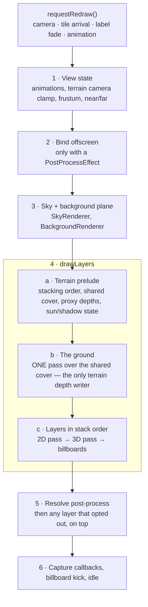

# How the renderer works

What the render path does, how it is implemented, how it compares to
[tangram-ng](https://github.com/farfromrefug/tangram-ng), and why it differs where it does.

Split so a reader — human or agent — can open **one** page and get a whole subsystem. Every page
states its scope at the top and links out rather than repeating.

## Pick your page

| You are working on | Read |
|---|---|
| anything at all, first time | [Frame & threads](01-frame.md) |
| frame order, threads, what runs where, redraw requests | [Frame & threads](01-frame.md) |
| which tiles are chosen, LOD, fetching, decoding (MVT and MLT), caches | [Tiles & LOD](02-tiles.md) |
| the GL draw path, style layers, draw counts, shaders | [GL vector-tile renderer](03-vt-renderer.md) |
| 3D terrain: elevation data, surfaces, the ground pass | [3D terrain](04-terrain.md) |
| bridges and tunnels: chords, decks, the opt-in switch, what is still wrong | [3D bridges](17-bridges.md) |
| z-fighting, see-through, content sinking into the ground | [Depth model](05-depth-model.md) |
| labels: placement, flicker, glyph sharpness, anchoring onto terrain | [Labels](06-labels.mdx) |
| hillshade, contour lines, contour labels, hypsometric tint | [Hillshade & contours](07-hillshade-contours.md) |
| sun, shadows, sky, fog | [Lighting, sky & fog](08-lighting-sky-fog.md) |
| `CompositeVectorTileLayer`, style-driven slots | [Composite layer](09-composite-layer.md) |
| markers, popups, app-drawn lines/polygons, picking | [Vector elements](12-vector-elements.md) |
| navigation maneuver arrows on a route | [Maneuver arrows](15-maneuver-arrows.md) |
| sun/moon/stars/aircraft placed in the sky | [Celestial objects](13-celestial.md) |
| full-screen effects, the relief look, layers drawn above them | [Post-processing](14-post-process.md) |
| making it faster, or measuring anything | [Performance](10-performance.md) |
| "why don't we just do what tangram does?" | [vs tangram-ng](11-tangram-diff.md) |
| which graphics API we target, ES 3.0, Metal, ANGLE, new platforms | [Graphics API migration](16-graphics-api-migration.md) |

The dated measurement history is a separate lab notebook:
[Performance log](../performance-log.md). These pages are the **current design**; that one is what
was tried.

## One frame

Detail in [Frame & threads](01-frame.md). The `PROF` sections of a `-PprofileRender` build map onto
these boxes one-for-one.

## Two rules that shaped the render code

**1. tangram-ng is the reference implementation, and we copy it.**
Where it does something differently, we adopt its way rather than designing an alternative. Its
constants are copied, not derived — every constant this project derived instead turned out wrong
(failure catalogue in
[Depth model](05-depth-model.md#four-ways-to-get-this-wrong-all-of-them-tried)). Each mechanism is
ported **whole**: half of their depth model was measurably worse than none of it, three times over.
When comparing, read their **scene files** (`res/scenes/*.yaml`), not only their shaders — the
shader defaults are overridden there.

**2. The RTT drape is being deleted and is deliberately not documented.**
The old path baked flat 2D content into per-tile render-target textures and textured the terrain
with them. It still exists behind `TerrainOptions.DrapeFillsEnabled` and `--es drape true` in the
demo, but the shared ground ([3D terrain](04-terrain.md)) replaced it. Do not build on it, and do
not extend these pages to cover it.

## Where the render code lives

| Path | What |
|---|---|
| `all/native/renderers/` | frame orchestration (`MapRenderer`), per-kind renderers, `TileRenderer` (the bridge into `vt`) |
| `all/native/renderers/workers/` | `CullWorker`, `VTLabelPlacementWorker`, `BillboardPlacementWorker` |
| `all/native/layers/` | `TileLayer`, `VectorTileLayer`, `RasterTileLayer`, `HillshadeRasterTileLayer`, `CompositeVectorTileLayer` |
| `all/native/terrain/` | `ElevationManager`, `ElevationTileGrid`, `TerrainTileTransformer` |
| `all/native/datasources/` | tile sources, including the on-the-fly `ContourTileDataSource` |
| `libs-massif/vt/` | the GL renderer: `GLTileRenderer`, `TileSurfaceBuilder`, `Label`, `LabelCuller`, shaders |
| `libs-massif/mapnikvt`, `cartocss` | tile decoding and style evaluation |

`vt` has **no logger** — probe it with `__android_log_print(4, "massif", …)`, and throttle a probe
shared by several renderer instances with a **prime** modulus.
