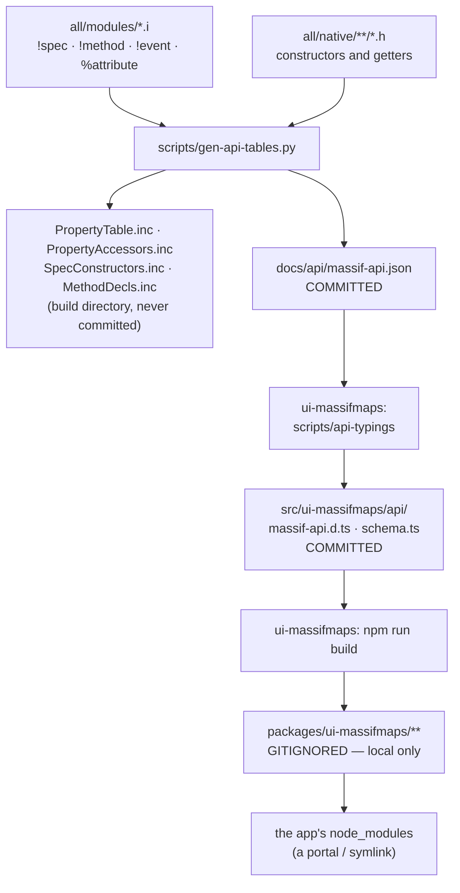

# From a `.i` file to an app's autocompletion

The facade's public surface is **declared** in `all/modules/*.i` and **consumed** as TypeScript in a
NativeScript app. Between the two there are four generated artefacts, in four different places. If
an app is reporting types that do not exist, or missing ones that do, the answer is always "one link
is stale" — and this page says which.

## The chain



Two of those are **committed generated files** — `docs/api/massif-api.json` and the plugin's
`massif-api.d.ts` / `schema.ts`. They are regenerated, not hand-edited, and they must be committed
alongside the `.i` change that caused them. An app never runs the generator.

The last one is **not** committed: `packages/**` is gitignored (`packages/**/*.d.ts`,
`packages/**/*js`). It exists only where somebody ran `npm run build`. That is the single most
important thing on this page — **an app linked to the plugin by a `portal:` / `file:` resolution
reads `packages/`, so a fresh clone of the plugin gives that app NO typings at all until the plugin
is built.** It is not stale, it is absent.

## The whole process, end to end

Run from the SDK root. Substitute the profile you build with — the schema only contains what the
defines let through, so generating with the wrong set **silently drops classes**.

```bash
python3 scripts/gen-api-tables.py \
  --defines "_MASSIF_PACKAGEMANAGER_SUPPORT;_MASSIF_VALHALLA_ROUTING_SUPPORT;_MASSIF_WKBT_SUPPORT;_MASSIF_ROUTING_SUPPORT;_MASSIF_GEOCODING_SUPPORT;_MASSIF_SEARCH_SUPPORT;_MASSIF_OFFLINE_SUPPORT;_MASSIF_EDITABLE_SUPPORT" \
  --sourcedir all/modules --cppdir all/native \
  --outdir /tmp/apitables --schema docs/api/massif-api.json
```

```bash
cd integrations/nativescript && npm run typings.api && npm run typings.api.check && npm run build
```

```bash
cd /path/to/your/app && npx tsc --noEmit -p tsconfig.json
```

The first command also prints the counts — properties, methods, events, and the classes it could
not build. **Read them.** "51 methods" going down after a change means a declaration was lost.

### The `--defines` trap

`--defines` **replaces** a profile's define set, it does not add to it. Passing a partial list
generates a schema missing every class behind the defines you left out, and nothing fails: the
plugin's typings regenerate happily, an app's `create('routing', …)` stops completing, and the
symptom shows up two repos away. Take the exact string from
[`scripts/build/sdk_profiles.json`](https://github.com/massif-maps/MassifMaps/blob/master/scripts/build/sdk_profiles.json)
— the `full` profile's `defines` is what the commands above use.

## Which link is stale?

In order — the first mismatch is the answer.

| Check | Command |
|---|---|
| the schema has the new thing | `grep instructionsJSON docs/api/massif-api.json` |
| a nested spec resolves to a kind | `grep -A2 '"kindOfClass"' docs/api/massif-api.json` — `set` needs it to build one |
| the plugin's typings match the schema | `cd integrations/nativescript && npm run typings.api` — a clean run rewrites nothing if it is current |
| the built package matches `src` | `diff <(md5 -q src/ui-massifmaps/api/massif-api.d.ts) <(md5 -q packages/ui-massifmaps/api/massif-api.d.ts)` |
| the app resolves the right package | `readlink -f node_modules/@nativescript-community/ui-massifmaps` |

The last one catches the most common failure by far: an app whose `resolutions` entry was changed
but which was never re-installed still points at the OLD checkout, and every symptom looks like a
missing type. `yarn install` (or `npm install`) relinks it.

The second most common: **the editor's TypeScript server caches `.d.ts` files**. After a rebuild,
restart it — in VS Code, *TypeScript: Restart TS Server*. `npx tsc --noEmit` from the command line
is the authority; if that is clean and the editor is not, it is the editor.

## What has to be committed together

A `.i` change that adds a `!spec`, `!method`, `!event` or `%attribute` is **not one file**:

1. the `.i` declaration,
2. the C++ that implements it — a `!method` with no `Methods::registerMethod` is reported at
   startup by `checkDeclarations` and completes to a call that fails,
3. `docs/api/massif-api.json`,
4. the plugin's `src/ui-massifmaps/api/massif-api.d.ts` and `schema.ts`.

Splitting those across commits leaves every intermediate commit describing an API that is not there.
Two things are deliberately NOT committed: the generated `.inc` files (they live in the build
directory) and `packages/**` (rebuilt locally, see above).

## Known gaps

- **Nothing checks the schema against the built typings in CI.** The mismatch is caught by whoever
  next runs `npm run typings.api` and sees a diff, which is late.
- **The schema is generated with ONE profile.** An app built `lite` gets typings promising classes
  its SDK does not contain; the failure is a runtime `RESULT_UNKNOWN_TYPE`, not a type error.
- **`packages/` is gitignored, so nothing guarantees it exists.** A contributor who clones the
  plugin and points an app at it sees no API until they build. `npm run build` belongs in the
  plugin's postinstall, or `packages/` belongs in git; today it is neither.
